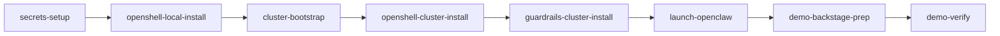

# Demo Backstage Install

Install everything needed **before the audience** for [`demo-narrative-v1.md`](../../docs/demo-narrative-v1.md). Nothing is toggled live during this phase except confirming direct MaaS.

## Skill sequence (canonical order)

| Step | Skill | Command summary |
|---|---|---|
| 0 | `secrets-setup` | `secrets/secrets.env` from template |
| 1 | `openshell-local-install` | CLI on workstation (once) |
| 2 | `cluster-bootstrap` | `make -C deploy deploy-all` |
| 3 | `openshell-cluster-install` | `make deploy-openshell` + UI proxy |
| 4 | `guardrails-cluster-install` | Verify NeMo Ready (deployed by step 2) |
| 5 | `launch-openclaw` | Demo policy + direct MaaS |
| 6 | `demo-backstage-prep` | Panels + confirm state |
| 7 | `demo-verify` | `VERIFY_PROFILE=demo ./scripts/verify.sh` |



## Automated workflow (copy-paste)

After `secrets-setup` and `openshell-local-install`:

```bash
./scripts/cluster-lifecycle.sh preflight

make -C deploy deploy-all
APPS_DOMAIN=$(oc get ingress.config.openshift.io cluster -o jsonpath='{.spec.domain}') \
  make -C deploy deploy-openshell
APPS_DOMAIN=$APPS_DOMAIN make -C deploy deploy-openclaw-ui-proxy

make -C deploy validate-guardrails

./scripts/ensure-mlflow-experiment.sh

POLICY_FILE=config/openshell/default.yaml \
INFERENCE_BACKEND=direct \
APPS_DOMAIN=$APPS_DOMAIN \
make -C deploy launch-openclaw

./scripts/demo-disable-guardrails.sh
VERIFY_PROFILE=demo ./scripts/verify.sh
```

## Expected result

| Component | State |
|---|---|
| RHOAI + MLflow + EvalHub | Deployed |
| NeMo Guardrails CR | Ready (not in live inference path) |
| OpenShell gateway | Connected |
| OpenClaw sandbox | `default.yaml` — MLflow-only egress; google.com blocked |
| Inference | `inference.local` → MaaS direct |
| MLflow tracing | On from first token |

Control UI: `https://openclaw-gw--openclaw-ui.<APPS_DOMAIN>/`

## Distinction from CI deploy

| Target | Policy | Verify profile |
|---|---|---|
| Demo backstage | `default.yaml` (MLflow only) | `VERIFY_PROFILE=demo` |
| CI / `make demo` | `default.yaml` | `VERIFY_PROFILE=full` |

Both use the same baseline policy; demo verify runs the narrative E2E (`test-demo`) instead of the full hardened suite.

## After AWS shutdown

If the cluster was stopped overnight (AWS) but Helm releases are still present:

1. Use skill **`demo-warmup`** — `./scripts/demo-warmup.sh` (status + auto-fix OpenClaw)
2. Do **not** re-run `deploy-all` unless `demo-warmup status` exits 2 (platform broken)

Then continue with `demo-backstage-prep` before going on stage.

## Teardown

1. `openshell-cluster-cleanup`
2. `cluster-cleanup`

## Related

- Live presentation: `demo-present`
- Reset rehearsal: `demo-reset`
- English script: [`docs/demo-script.md`](../../docs/demo-script.md)
