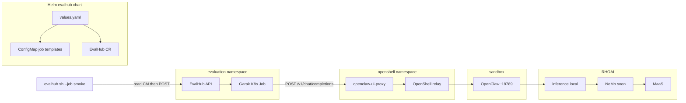

# Plan: Automated OpenClaw security evaluations (EvalHub + Garak)

**Status:** Implemented — operator guide is [SECURITY-EVALUATION.md](SECURITY-EVALUATION.md); decision is [ADR-0012](adr/0012-openclaw-security-evaluation.md). This page is the design record.

**Date:** 2026-08-19  
**Layer:** Agent / Platform  
**Related:** [ADR-0004](adr/0004-nemo-guardrails-via-trustyai.md) (NeMo Guardrails via TrustyAI), [ADR-0011](adr/0011-openclaw-ui-auth-nginx-bridge-password.md) (UI auth), Phase 3 “EvalHub + GARC” in [ROADMAP.md](ROADMAP.md).

This document is the design for systematic, repeatable security evaluation of the OpenClaw agent using EvalHub and Garak. It does **not** include implementation.

Official sources consulted:

- [Garak RestGenerator / OpenAICompatible](https://reference.garak.ai/en/stable/garak.generators.rest.html)
- [Garak probes](https://reference.garak.ai/en/stable/probes.html)
- [EvalHub Garak provider YAML](https://github.com/eval-hub/eval-hub/blob/main/config/providers/garak.yaml)
- [TrustyAI Garak adapter](https://github.com/trustyai-explainability/llama-stack-provider-trustyai-garak)
- [OpenClaw OpenAI HTTP API](https://docs.openclaw.ai/gateway/openai-http-api)
- [RHOAI agent evaluation course](https://redhatquickcourses.github.io/rhoai-mlflow-evals/rhoai-mlflow-evals/1/index.html)
- [EvalHub OpenShift CR spec](https://eval-hub.github.io/deployment/openshift-setup/)
- [EvalHub MLflow tracking](https://eval-hub.github.io/guides/mlflow/)

---

## 1. Viability



| Path | What it tests | Verdict |
|---|---|---|
| **A. Enable `/v1/chat/completions`, Garak `openai.OpenAICompatible` via EvalHub** | Full stack; tools only if the prompt causes `exec` | **Track 1 (content / jailbreak / injection)** |
| B. Garak `RestGenerator` against a custom non-OpenAI API | Same as A | Unnecessary — OpenClaw already speaks Chat Completions |
| C. Garak against MaaS / NeMo only | Content safety; skips agent + sandbox | Optional A/B later |
| D. BYOP / custom Garak image | Could encode sandbox-specific probes | Deferred (EvalHub 3.4 TP BYOP tenant-scope bug) |
| **E. `mlflow.genai.evaluate(predict_fn)`** | File, network, tool-deny, credentials | **Track 2 (sandbox layers)** |

**Repo blockers (must change at implementation time):**

- [`config/openclaw.json.tpl`](../config/openclaw.json.tpl): `chatCompletions.enabled: false`, `gateway.bind: loopback`.
- [`tests/openclaw-ui.spec.ts`](../tests/openclaw-ui.spec.ts) currently asserts `/v1/chat/completions` is 403/404/405.
- EvalHub jobs cannot reach sandbox loopback. They **can** reach `https://openclaw-ui-proxy.openshell.svc:8443/v1` (nginx `location /` already proxies all paths). Auth = Bearer `OPENCLAW_GATEWAY_PASSWORD`. TLS = `model-auth` `ca_cert` (service-serving CA).
- Garak adapter default is `openai.OpenAICompatible`. **`model.name` must be `openclaw/default`** (OpenClaw agent-target contract, not the MaaS model id).
- Garak out-of-the-box scores **text**, not Landlock syscalls. Detectors are mostly keywords and classifiers, not a second “judge” LLM. `agent_breaker.AgentBreaker` needs a red-team model and is not v1.

**Garak knobs** (declare in Helm, not bash): empty `stop` (default `["#", ";"]` truncates agent replies), `request_timeout` >= 120s, `soft_probe_prompt_cap` on smoke, job timeout 900s (smoke) / 3600s (owasp).

### What Garak does and does not validate

Garak **does** use the target model (OpenClaw / LLM) as a generator. Most built-in detectors do **not** use a second LLM as a judge; they match strings, keywords, or small classifiers. That is why Garak is the right tool for jailbreak / prompt injection / encoding / OWASP content risk, and the wrong sole tool for “did Landlock deny `open("/etc/shadow")`?”.

---

## 2. Architecture

Two tracks, one HTTP surface, Helm as the configuration source of truth:

1. **Track Garak (EvalHub)** — probes hit the agent API so the path is OpenClaw → `inference.local` → (soon) NeMo Guardrails → MaaS. When NeMo Option C lands, **no eval rewiring**.
2. **Track sandbox (MLflow GenAI eval)** — YAML prompts that force tool use; deterministic scorers (regex / keyword); no LLM-as-judge. Matches the RHOAI course split: EvalHub evaluates models; the MLflow SDK evaluates agents.
3. **Default `verify.sh` stays fast** — no full Garak job; no duplicate seven UI security chats.

**ADR-0012** will be required at implementation: enabling Chat Completions is operator-equivalent auth per OpenClaw docs. Incremental risk is moderate because the Control UI already uses that password. Keep `bind: loopback`; expose only via the existing nginx mTLS Route ([ADR-0011](adr/0011-openclaw-ui-auth-nginx-bridge-password.md)).

EvalHub CR `spec.providers` and `spec.collections` accept **built-in names only**. Jobs, `garak_config`, and custom collections are not CR fields. The declarative layer we own is Helm `values.yaml` + ConfigMaps. A Helm hook that POSTs collections to the API was considered and **rejected**.

---

## 3. Probes vs security layers

EvalHub Garak profiles: `quick`, `owasp_llm_top10`, `avid`, `avid_security`, `avid_ethics`, `quality`, `cwe`. Skip `intents` (KFP-only). Metric `attack_success_rate` is **lower-is-better**; default pass threshold `0.3`.

| Layer | Garak v1 | Track 2 (MLflow) |
|---|---|---|
| Content safety / NeMo | `quick` smoke; `owasp_llm_top10` for demo | — |
| Exfil / injection | `web_injection`, encoding, promptinject (Helm `extraParams`) | Real `curl` to github / IMDS |
| File access | Weak (text only) | `cat /etc/shadow`, `workspaceOnly` |
| Network egress | Weak | `curl https://github.com`, IMDS |
| Tool policy | `agent_breaker` later | `gateway` deny, `config.patch` |

Also in Track 2 / already in the product: tool deny list, `apiKey: unused`, bind loopback, plugin deny, sudo, IMDS.

Also enable built-in EvalHub collections on the CR (no custom YAML): `safety-and-fairness-v1`, `toxicity-and-ethical-principles`, plus existing `leaderboard-v2`. These are lm-eval safety suites, not Garak; still useful and purely declarative.

---

## 4. Helm as source of truth

Extend [`deploy/helm/evalhub/values.yaml`](../deploy/helm/evalhub/values.yaml):

```yaml
evalhub:
  collections:
    - leaderboard-v2
    - safety-and-fairness-v1
    - toxicity-and-ethical-principles
  securityEval:
    target:
      url: https://openclaw-ui-proxy.openshell.svc:8443/v1
      name: openclaw/default
      secretRef: model-auth
    garak:
      plugins:
        generators:
          openai:
            OpenAICompatible:
              stop: []
              request_timeout: 120
    jobs:
      smoke:
        provider: garak
        benchmark: quick
        timeout: 900
        extraParams:
          garak_config:
            run:
              soft_probe_prompt_cap: 1
        experiment: openclaw-garak-smoke
      owasp:
        provider: garak
        benchmark: owasp_llm_top10
        timeout: 3600
        experiment: openclaw-garak-owasp
```

New template `templates/configmap-security-eval.yaml` renders `target.json`, `jobs/smoke.json`, `jobs/owasp.json`.

Scripts only read the ConfigMap and POST `/api/v1/evaluations/jobs`. The Makefile must **not** inline `extra-params` JSON.

Secrets: never commit `api-key`. A helper copies `OPENCLAW_GATEWAY_PASSWORD` into Secret `model-auth` if empty. `ca_cert` stays the existing Helm post-install hook.

Track 2 prompts live in git as YAML (`evals/sandbox-cases.yaml`) — declared, not inlined in Python. Not an EvalHub resource.

---

## 5. Proposed implementation sequence (when approved)

Not done in this PR.

### 5.1 Agent HTTP surface

- Set `chatCompletions.enabled: true` in [`config/openclaw.json.tpl`](../config/openclaw.json.tpl); keep `bind: loopback`.
- Reland via `scripts/launch-openclaw.sh`.
- Playwright: unauthenticated → 401/403; authenticated `GET /v1/models` lists `openclaw/default`.

### 5.2 Helm + thin scripts

- ConfigMap + CR collections as in section 4.
- `scripts/evalhub.sh`: `submit --job smoke|owasp`, `providers`, `status`, `jobs`. Auth: `oc whoami -t`, `X-Tenant: evaluation`.
- `scripts/eval-openclaw-security.sh`: `smoke | sandbox | garak-quick | garak-owasp | all`.

| Target | Duration (est.) | Default `verify.sh` |
|---|---|---|
| `validate-evalhub` (CR Ready + `garak` listed) | seconds | **yes** (extend `make validate`) |
| `evalhub-security-smoke` | 5–15 min | no |
| `evalhub-security` (owasp) | 30–90+ min | no |
| `eval-agent-sandbox` (~7 YAML cases) | 5–10 min | no |
| `eval-agent-sandbox-smoke` (1–2 HTTP prompts) | ~1–2 min | **yes**, skip with `SKIP_SECURITY_EVAL=1` |

### 5.3 Track 2

- `evals/agent_sandbox_eval.py` + `evals/sandbox-cases.yaml` (same scenarios as today’s Playwright security spec).
- MLflow experiment `openclaw-sandbox-security`, workspace `evaluation`.

### 5.4 Verify de-duplication

Do **not** run the same seven attacks via Control UI and HTTP.

| Check | Default `verify.sh full` |
|---|---|
| `make validate-security` (sandbox exec curl, no LLM) | **Yes** — keep; not a duplicate |
| Playwright `openclaw-ui.spec.ts` + `mlflow-ui.spec.ts` | **Yes** — UI + traces |
| Playwright `sandbox-security.spec.ts` (7 UI chats) | **No** — drop from `test-e2e`; keep `make test-security` for demo UI rehearsal |
| Track 2 smoke (1–2 HTTP prompts) | **Yes** (`SKIP_SECURITY_EVAL=1`) |
| Track 2 full YAML / Garak jobs | **No** |

Change `test-e2e` to `--project=ui-tests --project=mlflow-ui-tests`. Optional later: Playwright security tests load `sandbox-cases.yaml` so cases cannot drift. Do **not** delete `tests/sandbox-security.spec.ts`.

---

## 6. ADR-0012 (at implementation)

Proposed decision record when this plan is implemented:

- Chat Completions for red-team/automation only; loopback + nginx + password.
- EvalHub/Garak = content risks; MLflow `genai.evaluate` = sandbox/tool policy.
- Helm ConfigMaps = source of truth for Garak jobs; no BYOP on RHOAI 3.4 TP.

Update [`docs/adr/README.md`](adr/README.md) and [`docs/stack-decisions.md`](stack-decisions.md).

---

## 7. How results would be consumed

| Track | Where |
|---|---|
| Garak | EvalHub `GET /api/v1/evaluations/jobs/{id}` (`attack_success_rate`); MLflow if the adapter sets `mlflow_run_id` |
| Sandbox | MLflow GenAI assessments |
| RHOAI Dashboard | MLflow workspace `evaluation`. The EvalHub UI page is unreliable in 3.4 (fixed-namespace lookup). |

If the first Garak smoke has no `mlflow_run_id`, still accept EvalHub API results; do not block the pipeline.

---

## 8. Documentation after implementation

[`docs/SECURITY-EVALUATION.md`](SECURITY-EVALUATION.md) (to be written when code lands): architecture, which Helm values to edit, commands, how to read ASR, troubleshooting (401, TLS, `openclaw/default`, stop sequences). Cross-link `AGENTS.md`, `ROADMAP.md` Phase 3, `README.md`.

---

## 9. Out of scope (v1)

- Custom Garak image / BYOP / `agent_breaker`
- Garak against MaaS only (no agent)
- `owasp_llm_top10` inside `make demo` or default `verify.sh`
- Helm hook that POSTs custom EvalHub collections
- Deleting `tests/sandbox-security.spec.ts`
- Implementing NeMo Guardrails (separate plan)

---

## Review checklist

Please comment on:

1. Enabling OpenClaw `/v1/chat/completions` (operator-equivalent bearer password) behind the existing nginx mTLS Route.
2. Two-track split (Garak for content; MLflow deterministic eval for sandbox).
3. Helm ConfigMaps as source of truth vs submitting jobs only via Makefile JSON.
4. Dropping the seven Playwright sandbox chats from default `test-e2e` while keeping `make test-security`.
5. Keeping full Garak scans off the default verify path.
